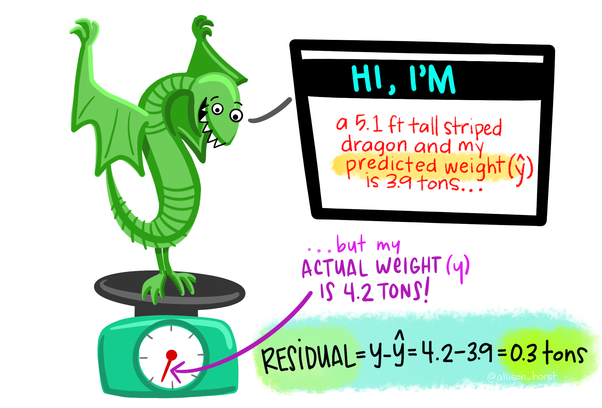

```{r libraries, results='hide', message = FALSE, echo = FALSE,  warning = FALSE}

#install.packages("tidyverse")
#install.packages("readxl")
#devtools::install_github("gadenbuie/xaringanExtra")
#install.packages("fontawesome")


library(tidyverse)
library(readxl)
library(lubridate)
library(xaringanExtra)
library(fontawesome)

knitr::opts_chunk$set(out.width = "70%", out.height = "70%",
                      message=FALSE, warning=FALSE, cache = FALSE, 
                      autodep = TRUE, hiline=TRUE)


xaringanExtra::use_xaringan_extra(include = c("panelset", "tile_view", "share_again", "use_broadcast"))

xaringanExtra::style_share_again(share_buttons = c("twitter", "linkedin", "pocket"))


xaringanExtra::use_extra_styles(
  hover_code_line = TRUE,         #<<
  mute_unhighlighted_code = TRUE  #<<
)


```


class: title-slide, center, bottom


# `r rmarkdown::metadata$title`


```{r, echo=FALSE, out.width=550, fig.align='center', fig.cap="Data Analysis assembly line: Wrangle, Visualise, Model"}

knitr::include_graphics("images/tidydata_5.jpg")

```


## `r rmarkdown::metadata$subtitle`


### `r rmarkdown::metadata$author`


#### Artwork by @allison_horst


### `r rmarkdown::metadata$date`


---

# You

* Are familiar with R. 

* Are new to linear modelling or haven't covered it in a while.

* Are new to linear modelling in R.


```{r, echo=FALSE, out.width=600, fig.align='center', fig.cap="Data Analysis assembly line: Wrangle, Visualise, Model"}

knitr::include_graphics("images/tidydata_5.jpg")

```
Artwork by @allison_horst

???

I'm assuming you are:

* Are familiar with R. 

* Are new to linear modelling or haven't covered it in a while.

* Are new to linear modelling in R.

---
# Getting started


* For this adventure you'll need the `tidyverse` meta-package, `broom` to tidy our models, and `GGally` to plot our coefficients.

```{r packages, eval = FALSE}

#install.packages(tidyverse)
#install.packages(broom)
#install.packages(GGally)

library(tidyverse)
library(broom)
library(GGally)

```

* And we'll be working with the data.frame `faculty_salaries.csv`.

???

We'll be using the tidyverse, broom, and GGally packages for this workshop. We will be working with the data.frame: faculty_salaries.csv

If it's the first time you've used the packages you will want to uncomment and run the install.packages code. If you have already downloaded the packages you can just call library.

---
class: inverse, middle, center


# Exploratory Data Analysis

???
The first section of the course is on Exploratory Data Analysis
---

#  Learning Objectives

*  What is the difference between a continuous and categorical variable?

--

*  What is variation and covariation?

--

*  Where does Exploratory Data Analysis fit in with analysis?

--

*  How to use plots to explore variation in 
    *	A continuous variable
    *	A categorical variable
--

* How to use plots to explore covariation between
    *	Two continuous variables
    *	A categorical and continuous variable. 
???

The learning objectives for this section are to understand:

* What is the difference between a continuous and categorical variable?

* What is variation and covariation?

* Where does Exploratory Data Analysis fit in with analysis?

* How to use plots to explore variation in a continuous and a categorical variable

And finally

* How to use plots to explore variation in a continuous and categorical variable. 

---

##  `r fa(name = "question-circle")` Numerical Variables: Continuous or Discrete?

```{r, echo=FALSE, out.width=550, fig.align='center', fig.cap="Numerical variables can be continuous or discrete. Continuous variables are measured data that can have infinite values within a possible range. An example is chick height (e.g. 3.1 inched) and weight (34.16 grams). For discrete variables observations can only exist at limited values, often counts (e.g. 8 legs and 4 spots)."}

knitr::include_graphics("images/continuous_discrete.png")

```
Artwork by @allison_horst

---

##  `r fa(name = "question-circle")` Categorical Variables: Nominal, Ordinal, Binary?

```{r, echo=FALSE, out.width=600, fig.align='center', fig.cap="Categorical variables can be nominal: unordered descriptions (e.g. turtles, snail, butterfly), ordinal: ordered descriptions (unhappy, okay, awesome), or binary: only 2 mutually exclusive outcomes (dinosaurs = extinct, sharks = alive."}

knitr::include_graphics("images/nominal_ordinal_binary.png")

```
Artwork by @allison_horst


`r fa(name = "brain")` **nominal** if they have no order and **ordinal** if there is an order, **binary** if there are only two options.

???
  - A `Categorical variable` is
  
        - `nominal` if they have no order (e.g. 'Ghana' and 'Uruguay')
        
        - `ordinal` if there is an order associated with them (e.g. 'low', 'medium', and 'high' income).
  

---

# Read in the data

```{r salaries, eval = TRUE}

salaries <- read_csv("../data/faculty-data.csv")

salaries <- salaries %>%
              mutate(department = as_factor(department))

```

???

Let's read in our faculty-data.csv and store this into the data.frame `salaries`. Let's make sure that department is a factor. 

---


## Explore the data

`r fa(name = "question-circle")` What are the variables in our data set?

```{r}

head(salaries)

```


???
We can explore our data by looking at the first six rows using the function `head`. From the output, what are the variables in our data set?

Answer:
- ids = id for each individual
- department = department (e.g. sociology, biology etc.)
- bases = starting salary
- experience = years of experience
- raises = raise per year
- salary = current salary


---
## Explore the data

`r fa(name = "question-circle")`  How many departments are in the data? 

`r fa(name = "question-circle")` How many employees are in each department?

```{r}

summary(salaries)

```

???
We can use summary to get a feel for the spread of our data including the range of saliaries, and the number of individuals in each department. 

---
## Exercise

`r fa(name = "question-circle")` What does each row in the data.frame represent?

```{r, eval = FALSE}

#View(______)

```
--

`r fa(name = "question-circle")`  Which variables are numeric?
--

`r fa(name = "question-circle")`  Are they continuous or discrete?
--

`r fa(name = "question-circle")`  Which variables are categorical?
--

`r fa(name = "question-circle")`  Are they nominal, ordinal or binary?

???
We can use View (with a capital V) to inspect our data. What does each row in our data.frame represent?
Answer: One employee at the University (i.e. a staff member)

Looking at the output from summary:
- Which variables are numeric?
Answer: bases, experience, raises, salary
- What variables are categorical?
Answer: This is a tricky one. In fact ids (although represented as a number) are categorical. Department is also categorical.
- Are the categorical variables nominal or ordinal?
Answer: Again this is tricky one. Both variables are nominal. The id number does not tell us anything about the person (e.g. if they are more experienced etc.) in which cases it is nominal. 
---

##  What is variation and covariation?

- `Variation`: is the tendency of values of a variable to change from measurement to measurement.  

--

- `Covariation`: tendency of values of a variable to change with the values of another variable.


???

Introduce the slide: Now we know more about the structure of our data we can explore the variation and covariation in the variables. Knowing the variation and covariation between variables can help us to understand the spread of the data and potential relationships in the data that may give insight into modelling.  

Variation is the tendency of values of a variable to change from measurement to measurement.

Covariation is the tendency of values of a variable to change with the values of another variable. 

(Lead in to next slide)
Visualisation is a great initial tool to explore these relationships further. How you visualise this variation depends on whether the variable is categorical or continuous.


---

## Where does Exploratory Data Analysis fit?


```{r, echo=FALSE, out.width=550, fig.align='center', fig.cap="Data Analysis assembly line: Wrangle, Visualise, Model"}

knitr::include_graphics("images/tidydata_5.jpg")

```

--


- Hypothesis generation

--

- Data exploration

--

- Formal statistical testing

???

So where does exploratory data analysis fall into our analysis work flow and how can we build it in effectively?

Data Visualisation is helpful for

- Hypothesis generation,
- Data exploration,
- and is supported by formal statistical testing. 

---
class: inverse, middle, center

# Using plots to explore variation and covariation

???

In this section we'll explore how we can use plotting to explore variation and covariation within our data.

To choose the most suitable visualisation to explore variation in a variable and covariation bewteen variables, we need to consider the type of variable(s) e.g. continuous or categorical. 

---

# Single continuous variable


.left-code[

```{r first-plot1a, eval=FALSE}
ggplot(data = salaries) +
   geom_density(aes(salary), fill = "blue")

```
]

.right-plot[
```{r first-plot1a, ref.label='first-plot1a', echo=FALSE, out.width="75%"}
```
]

???

To explore the variation in a single continuous variable, such as salary, we can use a density plot. The area under the density plot sums to one. It shows us the density of the data that lies at different values, in this case salary.

What do you notice from this plot about professor's salaries?

Answer: The data is bimodal, it has two peaks, there are a lot of professors whose salary is near 55,000 USD, and a large proportion of the professors whose salary is about 82,000. 


---
# Single categorical variable

.left-code[

```{r first-plot2a, eval=FALSE}

ggplot(data = salaries) +
   geom_bar(aes(x = department, fill = department)) +
   labs(x = "Department", y = "# Staff", fill = "Department")
  

```
]

.right-plot[
```{r first-plot2a, ref.label='first-plot2a', echo=FALSE, out.width="75%"}
```
]

???

For categorical variables we may want to visualise the counts of individuals in different categories. In this case we can look at the number of individuals in each department using a bar plot. 

What do you notice about the data from this plot?

Answer: each department has 20 individuals. This means that we have an even spread of the data. 

---
# Two continuous variables

.left-code[

```{r first-plot3a, eval=FALSE}

ggplot(data = salaries) +
  geom_point(aes(x = experience, y = salary, color = department))

```
]

.right-plot[
```{r first-plot3a, ref.label='first-plot3a', echo=FALSE, out.width="75%"}
```
]

???
To visualise two continuous variables we can use a scatter plot. In this case we can make a scatterplot to look at how salary (y-axis) changes with years of experience (x-axis). This is done using geom_point(). 

Q: Can you spot the third variable?
A: Department. 

---
# Two continuous variables


* **positive relationship** as one variable increases the other variable increases

???


Plotting two continuous variables, we can see how they change in relation to each other. Between the variables we may see:

* **positive relationship** as one variable increases the other variable increases

--

* **negative relationship** as one variable increases the other decreases

???

* **negative relationship** as one variable increases the other decreases

--

* **no relationship** no discernible pattern of change in one variable with the other.

???

* **no relationship** no discernible pattern of change in one variable with the other.

--

* **non-linear relationship** we may also be able to pick out other patterns, e.g. *polynomials*. 

???


* **non-linear relationship** we may also be able to pick out other patterns, e.g. *polynomials*. 


---
# Do salaries increase with experience?

.left-code[

```{r first-plot4a, eval=FALSE}

ggplot(data = salaries) +
  geom_point(aes(x = experience, y = salary, color = department))

```
]

.right-plot[
```{r first-plot4a, ref.label='first-plot4a', echo=FALSE, out.width="75%"}
```
]

???

What is the relationship between salary and experience?
Answer: positive relationship

Does it change by department?
Answer: Yes, some departments are steeper than others. 

---
# A discrete and continuous variable

.left-code[

```{r first-plot5a, eval=FALSE}

ggplot(data = salaries) +
  geom_boxplot(aes(x = department, y = salary, color = department))

```
]

.right-plot[
```{r first-plot5a, ref.label='first-plot5a', echo=FALSE, out.width="75%"}
```
]


???

We can use boxplots to visualise a discrete and continuous variable. In this case we can look at the spread of salary for each department. 

* A box plot gives us a visual representation of the distribution of numeric data using quartiles. It can be a good way to see how the data is spread and to identify potential outliers. 
    * The box plot shows the median (second quartile) in the middle of the plot.
    * The first and third quartile represent the interquartile range (25\% to 75\%). 
    * The minimum and maximum are defined as the (Q1 - 1.5 x IQ) and (Q3 + 1.5 x IQ).


---
# A discrete and continuous variable


.left-code[

```{r first-plot6a, eval=FALSE}

ggplot(data = salaries) +
  geom_violin(aes(x = department, y = salary, fill = department))

```

`r fa(name = "question-circle")` Which departments have the highest salaries? 


`r fa(name = "question-circle")` Do you think the departments are very different from one another?


]

.right-plot[
```{r first-plot6a, ref.label='first-plot6a', echo=FALSE, out.width="75%"}
```
]


???

Violin plots are what you get when you cross a box plot with a density plot. If you were to rotate the plot and look at the top half of the plot (it's symmetrical), this would be the same as the density plot. 

From violin plots we can get a better idea of the spread of the data and the shape. For instance look at the biology department. The distribution of salaries are skewed towards 55,000 but there is more of the data th is below 55,000 than above it. 


---
class: inverse, middle, center

# Model Basics and Construction

???

In the next section we will cover model basics and construction. 

---

# Learning objectives

* What is a model family and fitted model?

???

In this section, we will become familiar with:

* What is a model family and fitted model?

--

* What is the difference between a response and an explanatory variable?

???

* What is the difference between a response and an explanatory variable?

--

* How to construct a linear model in R.

???

* How to construct a linear model in R.

--

* What are the slope and intercept in a linear model?

???

* What are the slope and intercept in a linear model?

--

* Picking out key information from the model table

???

* Picking out key information from the model table

--

* How to extract specific parameters from the model object

???

* How to extract specific parameters from the model object


---
## Model families and fitted models

A goal of models is to partition data into **patterns** and **residuals**.

1. **Family of models:**
    * Express precise, but generic pattern you wish to capture. 
    * E.g., a straight line $y = ax + b$ or quadratic curve $y = ax^2 + bx + c$. 
    
???

* Ideally your model will 
    * capture **signals** (i.e. patterns)
    * and ignore **noise** (i.e. random variation).
 
A goal of models is to partition data into **patterns** and **residuals**.

There are two key parts to a model:

1. Family of models:
  * define a family of models that express precise, but generic pattern you wish to capture. For example, a straight line $y = ax + b$ or quadratic curve $y = ax^2 + bx + c$. Where $x$ and $y$ are known variables from your data, and $a$, $b$, and $c$ are parameters that can vary to capture different patterns. 
  
--

2. **Fitted model**
    * The **model family** is expressed as an equation.
    * In model fitting, the different parameters are able to take on different values to **adjust** the shape of the **fitted line** to the data.
    
???

2. Fitted model
    * After you've chosen your model family, the next step is to generate a fitted model from that family that is closest to your data. 
    * the **model family** is expressed as an equation, where the different parameters are able to take on different values to adjust the shape of the fitted line to the data.
    
--
    * N.B. The fitted model is just the closest model from a family of models. 
 
???

N.B. The fitted model is just the closest model from a family of models. 

---
## Model families and fitted analogy


* Models are garments and fitting models is like tailoring.

???

If we use clothes as an analogy, the family of models is like an assortment of garments you could choose to 'clothe' the data in. Just as some clothes will be more suitable than others depending on what you wish to do (e.g. nice dress to a wedding), the same is true for models. The type of model will depend on the type of data you have and what you wish to do with your analysis. 

Model fitting is similar to getting a garment tailored. Just as you might make alterations to improve the fit of a garment, you will adapt the chosen model to get a better fit to the data. 


---
## What is the difference between a response and an explanatory variable?


 * **Response variable**: the measured variable you are trying to explain
      * `Dependent`, `target` (machine learning) 

???

In data science you will see a number of terms used to refer to the same things. Here, we will use `response variable` to refer to the measured variable you are trying to explain. We will use `explanatory variables` to refer to the measured variables that we use to try to explain the response variable. Other terms that you may come across for these concepts include:
 * **response variable**: `dependent`, `target` (machine learning) 
      
--

 * **Explanatory variables**: measured variables that we use to try to explain the response variable. 
      * `Independent`, `features` (machine learning)

???

 * **explanatory variables**: `independent`, `features` (machine learning)

--

* Generally the response variable is shown on the y axis. 

???

Generally the response variable is shown on the y axis

---
## Linear Models

Linear models take the mathematical form:

$y = ax + b$

  * $y$ is the response variable 
  * $a$ is the slope 
  * $x$ is an explanatory variable
  * $b$ is the intercept.


???

Linear regression is one of the most important and widely used regression techniques. Its main advantage is its simple structure and ease of interpreting results.

The linear model takes the mathematical form:


$y = ax + b$

where

  * $y$ is the response variable 
  * $a$ is the slope 
  * $x$ is an explanatory variable
  * $b$ is the intercept.

---
## Linear Models

a and b are generally denoted by regression parameters $\hat{\beta_{0}}$ and $\hat{\beta_{1}}$. The $\hat{}$ indicates that these are estimated.


$$\hat{y_{i}} = \hat{\beta_{0}}+\hat{\beta_{1}}x_{i}+\epsilon_{i}$$
Notation:

???

a and b are denoted by regression parameters beta zero hat and beta one hat. The hat indicates that these are estimated parameters. 

--

* $\hat{y_{i}}$ is the response variable.

???

where y i hat is the reponse variable.

--

* $\hat{\beta_{0}}$ is the intercept of the line that best fits the data.

???

where beta zero hat is the intercept of the line that best fits the data. 

--

* $\hat{\beta_{1}}$ is the slope of the line that best fits the data.

???

where beta one hat is the slope of the line that best fits the data.

--

* $x_{i}$ is the explanatory variable.

???

where x i is the explanatory variable. 

--

* $\epsilon_{i}$ is the error term.

???

and epsilon i is the error term.

--
* $_i$ subscript indicates that the value can vary across cases/individuals/observations.

???

where the i subscript indicates that the value can vary across cases, individuals or observations depending on the model.

---
# Three different hypotheses

1. Starting salary and the rate at which salaries increase is the **same**.

???

With our models we will explore three different hypotheses about our data:

1. Starting salary and the rate at which salaries increase is the **same**.

--

2. Starting salary **differs** by department, but the rate at which salaries increase in the **same**.

???

2. Starting salary **differs** by department, but the rate at which salaries increase in the **same**.

--

3. Starting salary **differs** by department and the rate at which salaries increase is **different**. 

???

3. Starting salary **differs** by department and the rate at which salaries increase is **different**. 


---
# Hierarchical model animation

<iframe src="http://mfviz.com/hierarchical-models/" width="95%" height="90%" frameBorder="0"></iframe>


???

Our example today is inspired by the data visualisation project created by Michael Freeman.


---
class: inverse, middle, center

# Starting salary and the rate at which salaries increase is the **same**.

???

Let's look at the first hypothesis, that the "Starting salary and the rate at which salaries increase is the same.

---
## How to construct a linear model in R?

Form:

```{r, eval = FALSE}

m1 <- lm(y ~ x, data = df)

m1 <- lm(y ~ x1 + x2 + x3, data = df)

```

???

We can construct a linear model in R using the lm function. First you specify the formula as response variable tilde explanatory variable(s) and then the data = df. 

--
* Our hypothesis: starting salary and the rate at which salaries increase is the **same**.


* What are our response and explanatory variables in this case?

???

We are interested in the relationship between how salary increases with years of experience.  Our hypothesis is that the starting salary and the rate at which salaries increase in the same. 

What are our response and explanatory variables in this case?
--

```{r}

m1 <- lm(salary ~ experience, data = salaries)

```

???

The response variable is the salary and the explanatory variable is experience. 

--


$$salary_{i}=\hat{\beta_{0}}+\hat{\beta_{1}}experience_{i}+\epsilon_{i}$$
???

Here it is in its mathematical form.

---
class: inverse, middle, center

# Assessing Model Fit

???

In this next section we're going to look at how to assess model fit.

---

# Learning Objectives

* How to pick out key information from the table from a fitted model.

???

The learning objectives of the next section are: how to pick out key information from the table from a fitted model.

--

* How to inspect model residuals to assess model fit.

???

How to inspect the model residuals to assess model fit.

--

* How to use Adjusted R-squared and AIC to compare models.

???

How to use Adjusted R-squared and AIC to compare models.

---
# Picking out key information


```{r, size = "small"}
summary(m1)
```


???


The summary gives us a range of diagnostic information about the model we’ve fitted:

* **Call:** This is an R feature that shows what function and parameters were used to create the model.

* **Residuals:** difference of the observed value and the predicted value.

* **Estimate:** coefficient estimates for the intercept and explanatory variables.

* **Std Error:** standard errors (i.e. an estimate of the uncertainty) of the coefficient estimates.

* **t value**: t-statistic for the t-test comparing whether the coefficient is different to 0.

* **Pr(>|t|):** p-value for the t statistics, giving the significance of coefficient.

* **Residual standard error:** an expression of the variation of the observations around the regression line.

* **Multiple R-squared/Adj. R-squared:**  The proportion of the variance in the observed values explained by the model. The Adj. R-squared takes into account the number of variables in the model.

* **F-statistic, p-value:** Model fit info (allow you to compare different models to assess the best one)

---

# Key Information from the Model Summary


* **Intercept interpretation:** the starting salary is 62154 USD.

* **Slope interpretation:** with every year of experience an employee's salary increases by 683.5 USD. 

* **Amount of variation explained:** Overall the model is a poor fit, with only 0.01235 percent of the variation explained by the model as shown by the Adjusted R-squared.
???

* **Intercept interpretation:** the starting salary is 62154 USD.

* **Slope interpretation:** with every year of experience an employee's salary increases by 683.5 USD. 

* **Amount of variation explained:** Overall the model is a poor fit, with only 0.01235 percent of the variation explained by the model as shown by the Adjusted R-squared.


---
# Extracting the fitted model

Getting the fitted model.

```{r}

m1_results <- broom::augment(m1)


head(m1_results)
```

???

We can get the fitted model using the augment function from the broom package. 

---
#  Plotting the fitted model


.left-code[

```{r first-plot7a, eval=FALSE, warning = FALSE, message = FALSE}


ggplot(data = m1_results,
       aes(x = experience, y = salary)) +
  geom_point() +
  geom_smooth(method = lm, se = FALSE)

```
]

.right-plot[
```{r first-plot7a, ref.label='first-plot7a', echo = FALSE, out.width="65%"}
```
]

???

You can see from the fitted model, why it is such a poor fit. There are a lot of people that this line is not capturing. 

---
# The Residuals


```{r, echo=FALSE, out.width=580, fig.align='center', , fig.cap="Residuals is the information left over. For instance if a dragon's predicted weight is 3.9 tons but her actual weigh is 4.2 tons, the residual would be 0.3 tons"}



```
Artwork by @allison_horst

---
# The Residuals

.left-code[

```{r first-plot8a, eval=FALSE, warning = FALSE, message = FALSE}

ggplot(data = m1_results,
       aes(x = experience, 
           y = salary)) +
  geom_point() +
  geom_smooth(method = lm, se = FALSE) +
  geom_segment(aes(xend = experience, 
                   yend = .fitted), 
               color = "red", 
               size = 0.3)


```
]

.right-plot[
```{r first-plot8a, ref.label='first-plot8a', echo=FALSE, out.width="65%"}
```
]

???

I nthis plot we are visualising the residuals, using the distance from the value predicted to the actual salaries.  

Remember: The goal of models is to partition data into **patterns** and **residuals**.

---

# Inspecting model residuals

The diagnostic plots show residuals in four different ways:

* **Residuals vs Fitted:** is used to check the assumptions of linearity. If the residuals are spread equally around a horizontal line without distinct patterns (red line is approximately horizontal at zero), that is a good indication of having a linear relationship.

--

* **Normal Q-Q:** is used to check the normality of residuals assumption. If the majority of the residuals follow the straight dashed line, then the assumption is fulfilled.

--

* **Scale-Location:** is used to check the homoscedasticity of residuals (equal variance of residuals). If the residuals are spread randomly and the see a horizontal line with equally (randomly) spread points, then the assumption is fulfilled. 

--

* **Residuals vs Leverage:** is used to identify any influential value in our dataset. Influential values are extreme values that might influence the regression results when included or excluded from the analysis. Look for cases outside of a dashed line. 

---
## Residuals vs Fitted

.left-code[

```{r first-plot9a, eval=FALSE, warning = FALSE}


plot(m1, 1)


```
* **Residuals vs Fitted:** If the residuals are spread equally around a horizontal line without distinct patterns (red line is approximately horizontal at zero), that is a good indication of having a linear relationship.

]

.right-plot[
```{r first-plot9a, ref.label='first-plot9a', echo=FALSE, out.width="75%"}
```
]


---
## Normal Q-Q


.left-code[

```{r first-plot10a, eval=FALSE, warning = FALSE}


plot(m1, 2)


```
* **Normal Q-Q:**  If the majority of the residuals follow the straight dashed line, then the assumption is fulfilled.

]

.right-plot[
```{r first-plot10a, ref.label='first-plot10a', echo=FALSE, out.width="75%"}
```
]

---
## Scale-Location


.left-code[

```{r first-plot11a, eval=FALSE, warning = FALSE}


plot(m1, 3)


```

* **Scale-Location:** If the residuals are spread randomly and the see a horizontal line with equally (randomly) spread points, then the assumption is fulfilled. 

]

.right-plot[
```{r first-plot11a, ref.label='first-plot11a', echo=FALSE, out.width="75%"}
```
]

```{r}

plot(m1, 3)

```


---
# Residuals vs Leverage

.left-code[

```{r first-plot12a, eval=FALSE, warning = FALSE}


plot(m1, 4)


```

* **Residuals vs Leverage:** is used to identify any influential value in our dataset. Look for cases outside of a dashed line. 
]

.right-plot[
```{r first-plot12a, ref.label='first-plot12a', echo=FALSE, out.width="75%"}
```
]


---
class: inverse, middle, center

# Starting salary **differs** by department, but the rate at which salaries increase in the **same**.

---
# Plotting the data

.left-code[

```{r first-plot13a, eval=FALSE, warning = FALSE}


ggplot(data = salaries) +
  geom_point(aes(x = experience, 
                 y = salary, 
                 color = department)) +
  labs(x="Experience", y="Salary") +
  scale_colour_discrete('Department')


```

* Our data is "nested", that is we have groups within our data. We can add group, the department, as a third variable as the colour.

]

.right-plot[
```{r first-plot13a, ref.label='first-plot13a', echo=FALSE, out.width="75%"}
```
]


---
# Constructing the Linear Model

* How does the formula change if we think each group may have a different starting salary?

--

```{r}
m2  <- lm(salary ~ experience + department, data = salaries)

```

--
```{r}

m2_results <- broom::augment(m2)
```

---
# Plotting the fitted model

.left-code[

```{r first-plot14a, eval=FALSE, warning = FALSE}


ggplot(data = m2_results, 
       aes(x = experience, 
           y = salary, 
           colour = department)) +
  geom_point() +
  labs(x="Experience", y="Salary") +
  scale_colour_discrete('Department') +
  geom_line(aes(y = .fitted), size = 1) 


```


]

.right-plot[
```{r first-plot14a, ref.label='first-plot14a', echo=FALSE, out.width="75%"}
```
]


---
# Plotting the fitted model and residuals


.left-code[

```{r first-plot15a, eval=FALSE, warning = FALSE}

ggplot(data = m2_results, 
       aes(x = experience, 
           y = salary, 
           colour = department)) +
  geom_point() +
  labs(x="Experience", y="Salary") +
  scale_colour_discrete('Department') +
  geom_line(aes(y = .fitted), size = 1) +
  geom_segment(aes(xend = experience, yend = .fitted, colour = department), size = 0.3, linetype = 2)

```


]

.right-plot[
```{r first-plot15a, ref.label='first-plot15a', echo=FALSE, out.width="75%"}
```
]

-
# How is the model fit?

```{r}
summary(m2)

```

--

1. Slope Interpretation?
2. Intercept Interpretation?
3. Adjusted $R^2$

---
## Linearity

```{r, echo = FALSE, out.width ="48%"}

plot(m2, 1)

```
---
## Normal QQ


```{r, echo = FALSE, out.width ="48%"}

plot(m2, 2)

```

---
## Scale-Location

```{r, echo = FALSE, out.width ="48%"}
plot(m2, 3)
```

---
# Cook's Distance

```{r, echo = FALSE, out.width ="48%"}
plot(m2, 4)
```

---
## Plotting the coefficients


.left-code[

```{r first-plot16a, eval=FALSE, warning = FALSE}

GGally::ggcoef(m2)

```


]

.right-plot[
```{r first-plot16a, ref.label='first-plot16a', echo=FALSE, out.width="75%"}
```
]


---
# Extracting the coefficients

* Let's extract the residuals using `coef`

```{r}

m2_coef <- coef(m2)

names(m2_coef)

m2_coef

```

---
# Biology vs. Sociology

* If someone works in a department for 6 years, will they have a higher salary if they are in the biology or sociology department?


```{r}

biology_ex6 <- m2_coef["(Intercept)"] + m2_coef["departmentbiology"] + 6*m2_coef["experience"] 


sociology_ex6 <- m2_coef["(Intercept)"] + 6*m2_coef["experience"] 


```

---
# Plotting our predicted values

```{r, eval = FALSE}

m2_results <- broom::augment(m2)

ggplot(data = m2_results, 
       aes(x = experience, y = salary, colour = department)) +
  geom_point() +
  labs(x="Experience", y="Salary") +
  scale_colour_discrete('Department') +
  geom_line(aes(y = .fitted), size = 1) +
  geom_point(aes(x = 6, y = biology_ex6), color = "black") +
  geom_point(aes(x = 6, y = sociology_ex6), color = "black")


```

---
# Plotting our predicted values

```{r, echo = FALSE, out.width = "65%"}

m2_results <- broom::augment(m2)

ggplot(data = m2_results, 
       aes(x = experience, y = salary, colour = department)) +
  geom_point() +
  labs(x="Experience", y="Salary") +
  scale_colour_discrete('Department') +
  geom_line(aes(y = .fitted), size = 1) +
  geom_point(aes(x = 6, y = biology_ex6), color = "black") +
  geom_point(aes(x = 6, y = sociology_ex6), color = "black")


```

---

class: inverse, middle, center

#  Starting salary **differs** by department and the rate at which salaries increase is **different**. 

---
# Constructing the model

How do we include a random slope?


```{r}

m3 <- lm(salary ~ experience*department, data = salaries)

m3_results <- broom::augment(m3)

```

---
# Plotting the fitted model


.left-code[

```{r first-plot17a, eval=FALSE, warning = FALSE}

ggplot(data = m3_results, 
       aes(x = experience, 
           y = salary, 
           color = department)) +
  geom_point() +
  labs(x="Experience", y="Salary") +
  scale_colour_discrete('Department') +
  geom_line(aes(y = .fitted), size = 1)


```


]

.right-plot[
```{r first-plot17a, ref.label='first-plot17a', echo=FALSE, out.width="75%"}
```
]

---
# Plotting the fitted model with residuals

.left-code[

```{r first-plot18a, eval=FALSE, warning = FALSE}

ggplot(data = m3_results, 
       aes(x = experience, 
           y = salary, 
           color = department)) +
  geom_point() +
  labs(x = "Experience", 
       y = "Salary") +
  scale_colour_discrete('Department') +
  geom_line(aes(y = .fitted), size = 1) +
  geom_segment(aes(xend = experience, 
                   yend = .fitted, 
                   colour = department), 
               size = 0.3, 
               linetype = 2)
```


]

.right-plot[
```{r first-plot18a, ref.label='first-plot18a', echo=FALSE, out.width="75%"}
```
]

---
# Summary of the model


```{r}

summary(m3)

```

---

### Exercises

* Create the four model diagnostic plots. What do you make of the plots?


* **Residuals vs Fitted:** is used to check the assumptions of linearity. If the residuals are spread equally around a horizontal line without distinct patterns (red line is approximately horizontal at zero), that is a good indication of having a linear relationship.

* **Normal Q-Q:** is used to check the normality of residuals assumption. If the majority of the residuals follow the straight dashed line, then the assumption is fulfilled.


* **Scale-Location:** is used to check the homoscedasticity of residuals (equal variance of residuals). If the residuals are spread randomly and the see a horizontal line with equally (randomly) spread points, then the assumption is fulfilled. 

* **Residuals vs Leverage:** is used to identify any influential value in our dataset. Influential values are extreme values that might influence the regression results when included or excluded from the analysis. Look for cases outside of a dashed line. 

---
# Model 3 Residuals

```{r}
par(mfrow = c(1,2)); plot(m3, 1:2)
```
---
# Model 3 Residuals

```{r}
par(mfrow = c(1,2)); plot(m3, 3:4)
```


---
# What is the predicted salary with 7 years of experience in Biology?


```{r}

m3_coefs <- coef(m3)


```

```{r}

## Biology

biology_ex7 <- m3_coefs["(Intercept)"] + m3_coefs["departmentbiology"] + 7*(m3_coefs["experience:departmentbiology"] + m3_coefs["experience"])


```

---
# Exercise

What is the predicted salary for someone with 7 years of experience Sociology?


```{r, eval = FALSE}

sociology_ex7

```


Try plotting both salaries after 7 years on the graph.


```{r, eval = FALSE}

# ggplot(data = m3_results, 
#        aes(x = experience, y = salary, colour = department)) +
#   geom_point() +
#   labs(x="Experience", y="Salary") +
#   scale_colour_discrete("Department") +
#   geom_line(aes(y = .fitted), size = 1) +
#   geom_point(aes(x = ______, y = ______), color = "black") +
#   geom_point(aes(x = _____, y = ______), color = "black")

```
---


* Let's visualise the coefficients


```{r, out.width = "65%"}

GGally::ggcoef(m3)

```


* Which department has the highest raises (biggest slope)?

```{r}

biology_slope <- m3_coefs["experience:departmentbiology"] + m3_coefs["experience"]


```

* Which department has the highest starting salary (biggest intercept)?

```{r, echo = FALSE}

biology_intercept <- m3_coefs["(Intercept)"] + m3_coefs["departmentbiology"]

```

---


## Model Comparison

* How do we decide which model is better?

* The main metrics we will discuss in this course are:

  1. `Adjusted R^2`
  2. `AIC`
  3. `BIC`

* First, we will discuss `parsimony` and `Occam's Razor`

???

So how can we decide which model is better? There are a few metrics we can compare between the model that can be found in the top table. The three main ones we will discuss in this course are the `Adjusted R^2`, `AIC`, and `BIC`. Before getting to these concepts, let's discuss the concept of `parsimony` and `Occam's Razor`.

---
## Occam's razor: law of parsimony

* `Parsimony` (aka `Occam's razor`): 
    * Argument to choose simpler model over complex ones.
--
* **Model selection:** 
    * Complex model must not just be better, but a specified amount better than a simpler model. 

--

* **Practical considerations:**

  * Simple theories are easier to test than complex ones
  * Simple models often do a better job at predicting
  * Simple models require fewer parameters
  
???
`Parsimony` (aka `Occam's razor`) is a general argument for choosing simpler models even though we know the world is complex. Occam's razor says that when presented with competing hypotheses that make the same predictions, we should select the solution with the fewest assumptions. This is to say that all other things being equal, we should prefer a simpler model to a more complex one, especially when the data don't tell a clear story. 

Model selection approaches often go beyond parsimony to say that a more complex model must not be just better than, but a specified amount better than, a simpler model.

There is also a practical element to parsimony; simple theories are easier to test than complex ones. Similarly, simple models often do a better job at predicting. Because a simpler model requires fewer parameters it is also less expensive in terms of time or money to collect the data for it. 


We need to draw the line somewhere: 

As we add more parameters to a model, we necessarily get an increasingly accurate fit to the particular data we have observed (the bias of our predictions decreases), but our precision for predicting future observations decreases as well (the varaince of our predictions increases). 

One way to think about it is that data contain a fixed amount of information; as we estimate more and more parameters we spread the data thinner and thinner. Eventually the gain in accuracy from having more details in the model is outweighed by the loss in precision from estimating the effect of each of those details more poorly.


---
## Model Comparison: Adjusted $R^2$

**Adjusted R^2**

R-squared is a goodness-of-fit measure for linear regression models. 


$\frac{\text{Variance explained by the model}}{ \text{Total variance}}$

It indicates the percentage of the variance in the response variable explained by the explanatory variables. 

---
## Model Comparison: Likelihood

- `likelihood`: probability of observed outcome (i.e. the data) given a particular choice of parameters. 

--

- Maximum likeilhood: used to find the set of parameters **that make the observed data most likely to have occurred**. 

--

```{r, echo=FALSE, out.width=500, fig.align='center', fig.cap = "Likelihood is the probability of the observed outcome given a particular choice of parameters. For each response variable y we can look a where it falls on the probability curve."}

knitr::include_graphics("images/likelihood_example.png")
```
Source: Ashan Priyadarshana. [Maximum Likelihood Estimation published on medium](https://medium.com/quick-code/maximum-likelihood-estimation-for-regression-65f9c99f815d.)


???

The `likelihood` is the probability of the observed outcome (i.e. the data) given a particular choice of parameters. For a particular statistical model, maximum likelihood finds the set of parameters *that makes the observed data most likely to have occurred*. That is, we find the set of parameters that makes the likelihood as large as possible.

The diagram above shows what is happening when you are calculating the maximum likelihood. Here, we have a line of best fit, with the estimated values of the response variable $\hat y_{1...n}$ (red dots). The actual values of the response variable (our data), are reperesented by the black dots. The residuals are indicated by the $\epsilon$. These residual is the distance between the actual value of the response variable and the estimated value of the response variable. 

When we are calculating the maximum likelihood, we are looking for the parameters that maximise the likelihood of the data. The horizontal arrows trace up to the normal distribution which represents the fit. The closer to the peak of the distribution the data falls the "more likely" the data is given the parameters. 

For mathematical convience, we often work with the logarithm of the likelihood (the *log-likelihood*) instead of the likelihood. However, the parameters that give the maximum log-likelihood also give the maximum likelihood. 

---
## Model Comparison: Information Criteria

Information criteria are based on the expected distance between a particular model and the "true" model. 

--

* All information-theoretic methods involve finding the model that minimizes some criterion that is the sum of a term based on the likelihood and a *penalty term*.
    * often twice the negative log-likelihood is used.
    * penalty term varies for different information criteria. 

--

* Selecting models based on **information criteria** allows for the comparison of all candidate models at once, provided they are fit to the same data. 

???
**Information criteria** are based on the expected distance between a particular model and the "true" model. All information-theoretic methods reduce to finding the model that minimizes some criterion that is the sum of a term based on the likelihood (usually twice the negative log-likelihood) and a *penalty term* which is different for different information criteria. 

Selecting models based on information criteria allows for the comparison of all candidate models at once, provided they are fit to the same data. If there are missing values in certain variables and not others, the model will exclude these data when fitting by default, so you need to be careful that you are not comparing models which have been fit to different datasets. 

---
## Akaike Information Criterion

The `Akaike Information Criterion`, or AIC, is the most widespread information criterion, and is defined as

$\text{AIC} = -2L + 2k$

- $L$ is the log-likelihood
--
- $k$ is the number of parameters in the model. 
--
- Small values represent better overall fits
--
- Adding a parameter with a negligible improvement in fit penalizes the AIC by 2 log-likelihood units.

---
## Some rough guidance for AIC

- Lower values of AIC indicated a better fit to the data regardless of whether they are positive or negative.

--

- E.g. If you have two models with AIC: -213.09, and -289.12. The model with AIC -289.12 is better.

--

- AIC comparisons are only valid for models that are fit to the same response data (i.e. same y)

--

- For AIC, the rule of thumb people generally follow is that improvements of greater than 2 mean we can select the more complicated model.

---
## BIC
- The *Bayesian* information criterion (BIC) is the second most common.

--

- It uses a penalty term of $(log n)k$. 

--

- The BIC is more conservative than the AIC
    - insists on a greater improvement in fit to accept a more complex model.

---
## Approaches to model selection

- Models with multiple parameters and possible interactions between variable lead to a large number of models to try. 

- Two simple approaches to model selection include:

    - **forward selection** (add parameters one at a time to the simplest model)
    - **backward selection** (subtract parameters from the most complex model). 


---

# Comparing models using glance()

```{r}

broom::glance(m1)
broom::glance(m2)


```
---

# Comparing models using glance()

```{r}

broom::glance(m2)
broom::glance(m3)


```

???

The summary gives us a range of diagnostic information about the model we've fitted, split into three tables. Here's a quick guide on what is included:

**Top Table - model fit info.**

  * **R-squared/Adj. R-squared** - The proportion of the variance in the response variable ('petal_width') explained by the model. The Adj. R-squared takes into account the number of variables in the model.
  * **No. of Observations** (i.e. measurements of 'petal_width') and  **Df** degrees of freedom (No. of Observations - (1 + No. of variables in the model)).
  * **General info** - date and time that model was run, type of model etc.
  * **Model Fit info** - inc. **F-statistic**, **AIC** and **BIC**, **Log-Likelihood**. They are not meaningful on their own, but allow you to compare different models to assess the best one. 
    
**Middle Table - an important table!**

  * **coef** = coefficient estimates for the intercept and explanatory variables.
  * **std err** = standard errors (i.e. estimate of the uncertainty) of the coefficient estimates.
  * **t** = t-statistic for the t-test comparing whether the coefficient is different to 0.
  * **P>|t|** = p-value for the t statistics, giving significance of coefficient.
  * **[0.025 0.975]** = 95% confidence interval around the coefficient estimate.
    
**Bottom table - Diagnostics**

  * **Jarque-Bera**, **Omnibus**: test normality of residuals.
  * **Cond, No.**: Condition Number, test for multicollinearity.
  * **Durbin-Watson**: test for autocorrelation.


---

class: center, middle

# Thanks!


Slides created via the R package [**xaringan**](https://github.com/yihui/xaringan).

The chakra comes from [remark.js](https://remarkjs.com), [**knitr**](http://yihui.name/knitr), and [R Markdown](https://rmarkdown.rstudio.com).

The gorgeous artwork comes from [@allison_horst](https://github.com/allisonhorst/stats-illustrations)
